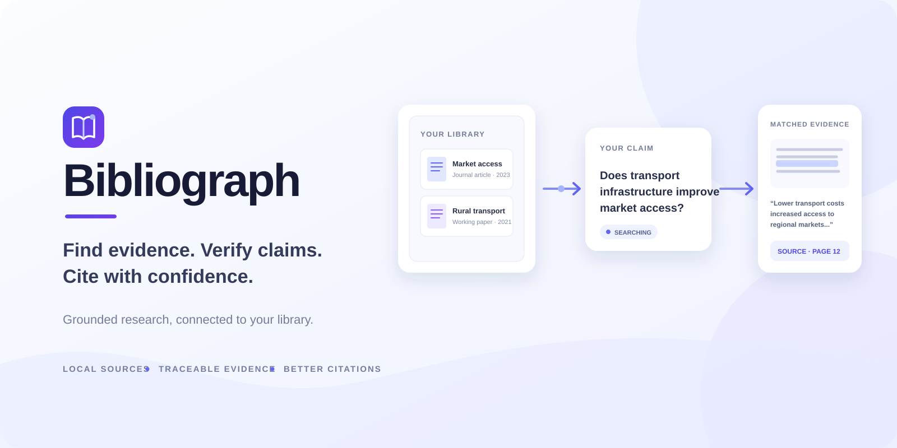
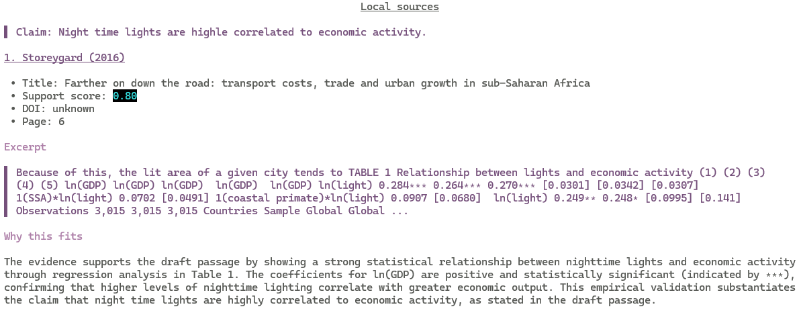

# Bibliograph

Bibliograph finds evidence for claims in a local paper library and helps verify citation support. It indexes Zotero collections or local PDFs, then searches the index with hybrid vector, lexical, and graph retrieval. Search results include source details, an excerpt, and an explanation; optional LLM stages can expand queries, rerank candidates, select evidence, and write rationales.

[Ikarus](https://github.com/sebastianjkern/ikarus) provides the SQLite-backed retrieval infrastructure. Bibliograph supplies the paper-oriented indexing and citation workflow, CLI, and result presentation.



## Install

Bibliograph requires Python 3.12 or newer and uses [uv](https://docs.astral.sh/uv/).

```bash
uv python install 3.12
uv sync --extra all --extra dev
```

To reinstall the development environment after pulling changes:

```bash
uv sync --extra all --extra dev --reinstall
```

The `all` extra installs PDF extraction, Zotero, local embedding, OpenAI-compatible, and remote-acquisition integrations. You can omit it and install only the extras you need. The browser fallback for remote PDF acquisition also requires Chromium:

```bash
uv run playwright install chromium
```

## Configure

Copy the example configuration and edit it for your library and providers:

```bash
cp bibliograph.toml.example bibliograph.toml
```

On Windows PowerShell:

```powershell
Copy-Item bibliograph.toml.example bibliograph.toml
```

Configuration is organized into profiles. This example uses Ollama for embeddings and chat, and demonstrates model overrides for individual LLM tasks:

```toml
[profiles.default]
db = "bibliograph.db"
pdf_dir = "pdfs"
collection = "My Collection"

[profiles.default.embedding]
provider = "ollama"
model = "nomic-embed-text"
base_url = "http://localhost:11434"
batch_size = 32

[profiles.default.llm]
provider = "ollama"
model = "edtorre/gemma4:12qat-hermes" # default for stages without an override
base_url = "http://localhost:11434"
mode = "optional" # off, optional, or required
stages = ["expand", "rerank", "evidence", "rationale"]

[profiles.default.llm.models]
expand = "qwen3:8b"
rerank = "rnj-1"
evidence = "gemma3:4b"
rationale = "gemma3:4b"

[profiles.default.acquisition]
order = ["cache", "zotero-storage", "zotero-api", "remote"]
```

`llm.models` is optional. Its keys are `expand`, `rerank`, `evidence`, and `rationale`; each value is a model name. An omitted stage uses `llm.model`. The provider, endpoint, and credentials in `[profiles.default.llm]` are shared by all stages. The `stages` list controls which tasks are enabled, independently of the model overrides.

Ingest-time evidence-role classification is separately opt-in with `[profiles.default.classification] enabled = true`. It labels chunks as background, data, methods, results, robustness, discussion, or limitations, and stores classifier scores in the index. It uses the configured chat provider and `llm.model` unless `classification.model` overrides it. Classification adds model calls during indexing; optional LLM mode leaves a chunk unclassified if a call fails. Enabling or changing the profile requires `sync --rebuild` before searching the index.

Choose a profile with `--profile`:

```bash
uv run bibliograph --profile local search "Road infrastructure improves regional market access"
```

Settings precedence is command-line override, environment variable, selected TOML profile, then built-in default. Put global CLI overrides before the command:

```bash
uv run bibliograph --profile local --embedding-model nomic-embed-text sync
```

### Secrets and providers

Keep secrets in `.env` rather than in the TOML file. The generic `BIBLIOGRAPH_*` variables are preferred; established `ZOTERO_*`, `OPENAI_*`, `OLLAMA_*`, and remote-acquisition variables remain supported for compatibility.

```env
BIBLIOGRAPH_ZOTERO_LIBRARY_ID=your_library_id
BIBLIOGRAPH_ZOTERO_LIBRARY_TYPE=user
BIBLIOGRAPH_ZOTERO_API_KEY=your_api_key
BIBLIOGRAPH_REMOTE_UNPAYWALL_EMAIL=you@example.org
```

Set `BIBLIOGRAPH_ZOTERO_LIBRARY_TYPE=group` for a Zotero group library. Bibliograph checks configured and common Zotero storage locations before trying the Zotero API or legal remote sources.

For an Ollama profile, start Ollama and pull the embedding model and each chat model you have configured:

```bash
ollama pull nomic-embed-text
ollama pull edtorre/gemma4:12qat-hermes
ollama pull qwen3:8b
ollama pull rnj-1
ollama pull gemma3:4b
```

OpenAI-compatible chat and embedding providers use `provider = "openai"`, with `base_url` and the relevant API-key environment variable. Local SentenceTransformers embeddings use `provider = "sentence-transformers"`. The deterministic `hash` embedding provider is useful for offline smoke tests.

With `llm.mode = "optional"`, provider or structured-output failures are logged and fall back to deterministic behavior. `required` makes such failures command errors; `off` disables LLM stages. Reranking and evidence extraction request structured JSON output. Reranking judgments are converted to a support score locally rather than relying on an LLM-generated numeric score.

## Commands

`sync` and `ingest` (alias: `ingest-pdfs`) write to the index. `search`, `check`, and `status` are read-only.

```bash
# Synchronize the configured collection, or name a collection explicitly.
uv run bibliograph sync
uv run bibliograph sync "My Collection"

# Build and validate a replacement index before swapping it into place.
uv run bibliograph sync --rebuild

# Force reindex PDFs in the selected Zotero collection:
uv run bibliograph sync --reset-pdf-index

# Index PDFs from a local directory; recursive by default:
uv run bibliograph ingest ./papers
uv run bibliograph ingest-pdfs ./papers --non-recursive

# Force reindex PDFs found in that directory:
uv run bibliograph ingest-pdfs ./papers --reset-pdf-index

# Search the index for evidence supporting a claim.
uv run bibliograph search "Road infrastructure improves regional market access"

# Keep at most one result excerpt from each paper (opt-in).
uv run bibliograph search --one-per-paper "Road infrastructure improves regional market access"

# Check a LaTeX or Typst draft against the existing index.
uv run bibliograph check example.tex

# Inspect the index without loading providers or Zotero.
uv run bibliograph status

# Also probe configured providers and Zotero access.
uv run bibliograph status --probe
```

### Search and check options

Both `search` and `check` accept:

- `--limit N` and `--min-score SCORE` to adjust retrieval.
- `--no-llm` to disable all LLM stages, or `--no-rerank` and `--no-evidence-extraction` to disable individual stages.
- `--no-enrichment` to disable evidence selection and rationale generation while retaining deterministic excerpts.
- `--output PATH` to write the Markdown report to a file.

`search` also accepts `--one-per-paper`. By default, search may return several useful excerpts from the same paper. Use this flag when you want no more than one excerpt per paper. Draft checking continues to select at most one result per claim.

When query expansion is enabled, Bibliograph prints the generated alternative queries during the query-planning step, before candidate retrieval starts. The LLM creates bounded search hypotheses; Ikarus deduplicates semantic and lexical seeds, expands them through the paper graph, and ranks candidates. If reranking is enabled, it refines the candidates before excerpts are presented.

`--reset-pdf-index` (short alias: `--reset`) forces reindexing of PDFs discovered by that command (the selected Zotero collection or local directory); it replaces those documents through the normal indexing path and leaves unrelated indexed sources untouched. A rebuild validates the configured embedding model before replacing the live database. If the embedding provider cannot be reached, the live database remains untouched. Each database has one active vector space and embedding fingerprint; changing the embedding provider or model requires a rebuild. Legacy databases remain inspectable with `status` but must be migrated with `sync --rebuild` before they can be searched or incrementally synchronized.

For one compatibility release, `find-sources` and `find` delegate to `search`, `suggest` delegates to `check`, and `check DRAFT COLLECTION` synchronizes before checking. These commands issue deprecation warnings. Prefer `sync --rebuild` over the legacy `--rebuild-db` spelling.

## Development

```bash
uv run ruff check .
uv run pytest
```

The main package boundaries are:

```text
bibliograph/
  cli.py          argument parsing, dispatch, exit codes
  bootstrap.py    composition root and dependency lifetimes
  settings.py     TOML, environment, and CLI resolution
  domain.py       Paper and Chunk durable records
  adapters/       Ikarus, Zotero, PDF, and acquisition adapters
  pipeline/       retrieval, LLM tasks, indexing, and draft parsing
  commands/       sync, PDF ingestion, search, check, and status workflows
  render.py       Markdown rendering
```

Provider runtimes are constructed through Ikarus's `adapters.providers.model_runtimes` registry; command and pipeline code should not branch on provider names. Always verify retrieved evidence before inserting a citation into a manuscript.
